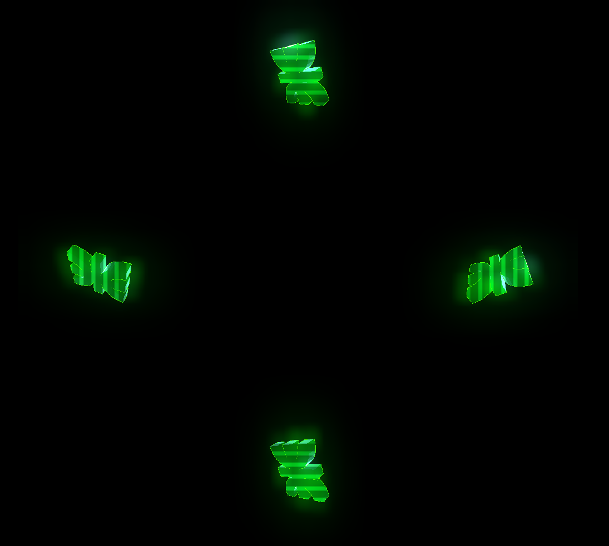

# Logo en holograma de la UTN 

Un holograma del logo de utn para usar con una piramide de cristal.

# 🔧 Instalación

Descarga el repo y abrelo con [Godot 3.5](https://godotengine.org/), pudes ejecutarlo desde el engine presionando F5, o descargar las siguientes builds.

* Windows (Pendiente)
* Linux (Pendiente)

